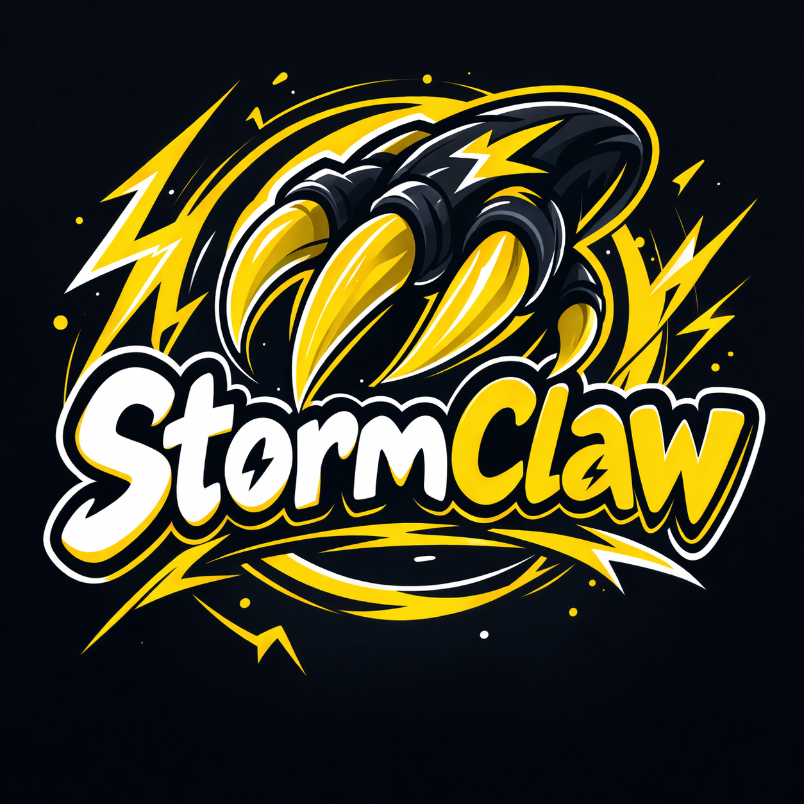

# StormClaw
### Personal AI assistant

### Setup
1. Create .env
<pre>
cp .env.example .env 
</pre>
1. Open Telegram
2. Look for @BotFather and type /newbot to it
3. Choose a name and an username to your bot.
4. Copy Telegram token and paste it to TELEGRAM_BOT_TOKEN (file .env)
5. Look for @userinfobot in Telegram and type /start to it
6. Copy Telegram chat_id and paste it to ALLOWED_CHAT_IDS (file .env)

### Execution
1. Create virtualenv:
<pre>
python -m venv venv
</pre>

2. Activate it:
<pre>
#Linux
source venv/bin/activate

#Windows
.\venv\Scripts\activate
</pre>

3. Install requirements.txt:
<pre>
pip install -r requirements.txt
</pre>

4. Install [Ollama](https://ollama.com/download)

5. Open a terminal and run Ollama. Keep this terminal always open to keep Ollama alive.
<pre>
ollama serve
</pre>

6. Open another terminal and get model qwen2.5
<pre>
ollama pull qwen2.5
</pre>

7. Run main
<pre>
python main.py
</pre>

Now you're ready to use your StormClaw via Telegram!
